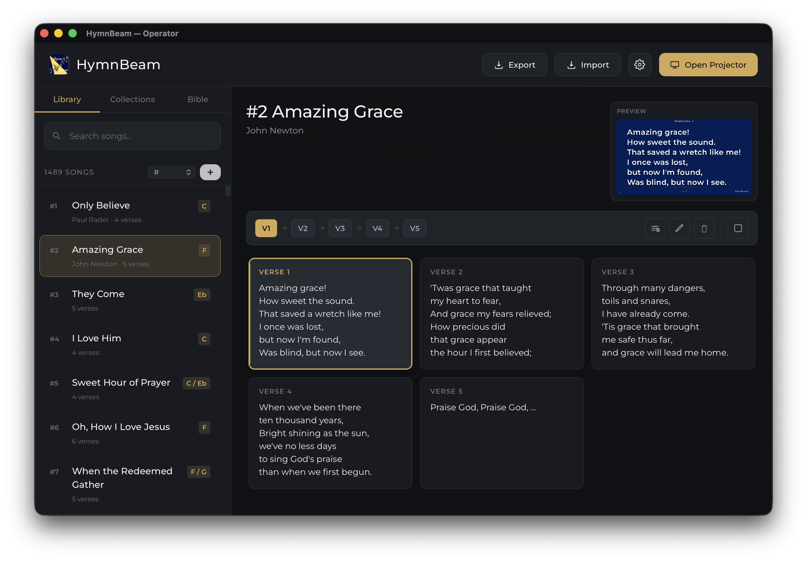
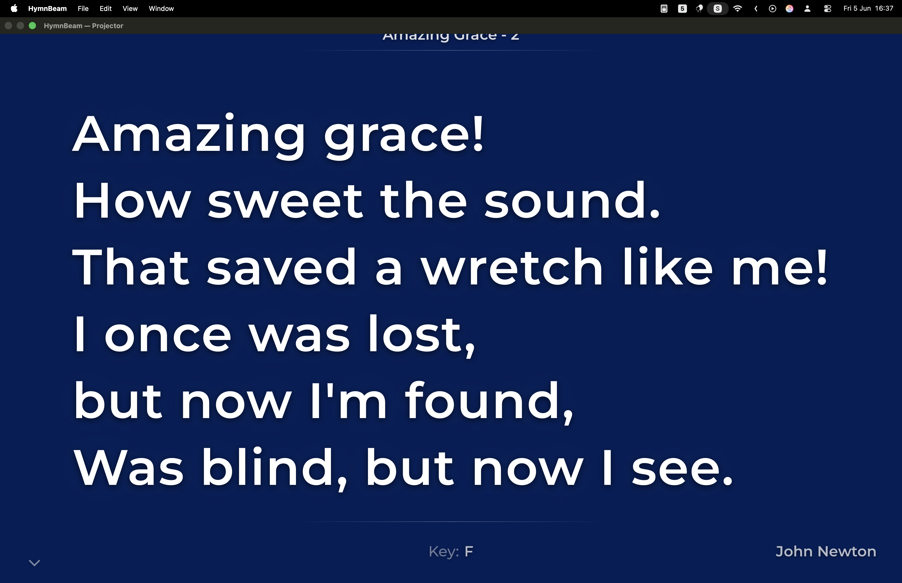

<div align="center">
  
  <h1>HymnBeam</h1>
  <p>Church song-lyrics projector for macOS — dual-window operator/projector layout, KJV Bible integration, and a portable song library.</p>

  [](https://github.com/wanmekwi/hymnbeam/releases/latest)
  [](LICENSE)
  []()
</div>

---

## Install

### Homebrew (recommended)

```bash
brew tap wanmekwi/hymnbeam
brew install --cask hymnbeam
```

The Homebrew cask strips the Gatekeeper quarantine flag automatically — no extra steps needed.

### Direct download

1. Go to the [latest release](https://github.com/wanmekwi/hymnbeam/releases/latest) and download **HymnBeam\_x.x.x\_universal.dmg**.
2. Open the DMG and drag **HymnBeam** to `/Applications`.
3. Eject the DMG.
4. **First launch only** — macOS will block the app because it is not notarized. Choose one of:
   - Right-click **HymnBeam.app** → **Open** → confirm in the dialog, **or**
   - Run this once in Terminal to clear the quarantine flag:
     ```bash
     xattr -dr com.apple.quarantine "/Applications/HymnBeam.app"
     ```

The DMG is a **universal binary** — runs natively on Apple Silicon and Intel Macs.

---

## Screenshots

| Operator window | Projector output |
|---|---|
|  |  |

---

## Features

- **Dual-window layout** — operator control panel on one screen, full-screen projector output on another.
- **Multi-monitor routing** — automatically sends the projector window to a secondary display.
- **KJV Bible integration** — browse books, chapters, and verses; project any passage with the same keyboard-first workflow as songs. Translator-added words shown in italics.
- **Reference lookup** — type any common abbreviation or variation (`Ecc 9:11`, `ec 9 11`, `ecclesiastes 9:11`) and HymnBeam resolves it to the right verse.
- **Collections** — group songs into ordered setlists; navigate through them with a single keystroke.
- **Full-text search** — search songs by title, author, or lyrics; search the entire KJV by keyword.
- **Song import / export** — JSON, CSV, and plain-text formats.
- **Background images** — upload custom backgrounds per-song or as a global default.
- **Portable library** — single SQLite database in `~/Library/Application Support/HymnBeam/`.
- **Keyboard-first** — every action reachable without a mouse (see shortcuts below).

---

## Song Database Conversion

The companion website **[vsb.bibeltroen.no](https://vsb.bibeltroen.no)** lets you convert song databases between different formats online. Use it to migrate an existing library into one of the formats HymnBeam can import (JSON, CSV, plain text), or to convert a HymnBeam export for use in another application.

---

## Keyboard Shortcuts

| Key | Action |
|-----|--------|
| `→` / `←` | Next / previous verse |
| `Space` | Blank / unblank screen |
| `1`–`9` | Jump to verse 1–9 |
| `0` | Jump to verse 10 |
| `Escape` | Clear display |
| `F` | Focus projector window |
| `⌘,` | Display settings |
| `⌘N` | New song |
| `⌘E` | Edit selected song |
| `⌘⌫` | Delete selected song |
| `⌘I` | Import songs |
| `⌘⇧P` | Open / close projector |
| `⌘B` | Blank screen |

---

## Song File Formats

### JSON

```json
{
  "title": "Song Title",
  "author": "Author Name",
  "verses": [
    { "label": "Verse 1", "text": "Lyrics here..." },
    { "label": "Chorus",  "text": "More lyrics..." }
  ]
}
```

### CSV

```csv
title,author,verse_label,verse_text
Song Title,Author,Verse 1,"Lyrics here..."
Song Title,Author,Chorus,"More lyrics..."
```

### Plain Text

```
Song Title
Author Name

[Verse 1]
Lyrics here...

[Chorus]
More lyrics...
```

---

## Development

**Requirements:** a Rust toolchain ([rustup.rs](https://rustup.rs)) and the Tauri CLI.

```bash
cargo install tauri-cli
cargo tauri dev
```

The embedded `axum` HTTP server starts on an OS-assigned port before the operator window opens. The frontend reads the port via the `get_api_port` Tauri command — there is no separate backend process.

Song library and uploaded backgrounds are stored in `~/Library/Application Support/HymnBeam/`.

---

## Project Structure

```
hymnbeam/
├── src-tauri/            # Tauri (Rust) shell + embedded HTTP server
│   ├── src/main.rs       # Window management, IPC, native menus
│   ├── src/api.rs        # axum routes (songs, collections, settings, …)
│   ├── src/db.rs         # SQLite setup, FTS5 tables, migrations
│   ├── src/songs.rs      # Song CRUD
│   ├── src/collections.rs# Collections CRUD
│   ├── src/import.rs     # JSON / CSV / text parsers
│   ├── src/export.rs     # JSON / CSV / text exporters
│   ├── src/settings.rs   # Display settings (single-row JSON blob)
│   ├── src/backgrounds.rs# Background image upload + serving
│   ├── src/bible.rs      # KJV Bible lookup + FTS5 search
│   └── tauri.conf.json   # Bundle config
├── frontend/             # Web UI loaded by the Tauri webview
│   ├── index.html        # Operator window
│   ├── projector.html    # Projector display
│   ├── css/              # Stylesheets
│   ├── js/               # Application logic
│   ├── fonts/            # Bundled WOFF2 fonts (SIL OFL)
│   └── img/              # In-app logo art
├── src-tauri/icons/      # App icon variants (.icns / .ico / png)
├── songs/                # Sample song files
├── docs/                 # Screenshots for README
└── build-macos.sh        # Universal-binary build + ad-hoc sign
```

---

## Building for Distribution (macOS)

Build a universal (Apple Silicon + Intel) `.app` and `.dmg`, ad-hoc signed:

```bash
./build-macos.sh
```

Output lands in `src-tauri/target/universal-apple-darwin/release/bundle/`.

For a single-arch local build: `cargo tauri build` from inside `src-tauri/`.

### Notarization (optional upgrade)

The distributed binary is ad-hoc signed. With an Apple Developer ID you can notarize it with `notarytool` + `stapler` to remove all Gatekeeper prompts for end users. See [Apple's notarization guide](https://developer.apple.com/documentation/security/notarizing-macos-software-before-distribution) for details.

---

## License

MIT — see [LICENSE](LICENSE).
